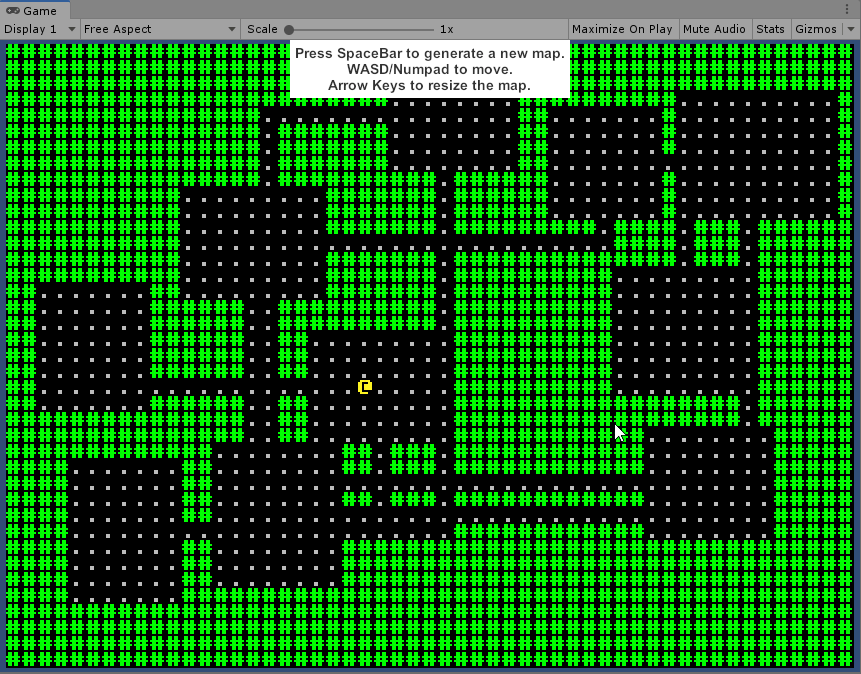

#### [« Previous: 1.2 - Walking a Map](../1.2-WalkingAMap/README.md) —  [Next: In Progress... »]

# 1.3 - A More Interesting Map

In this chapter we create a more "rogue-like" map of rooms and tunnels.

Most of the code is the same as the previous example. The biggest difference is in `GenerateMapSystem`. Instead of creating an empty map and placing random walls, we fill the entire map with walls and carve out our rooms and tunnels. Room placement happens in `GenerateRooms`. First we generate a randomly sized room:


###### [GenerateMapSystem.cs](Map/GenerateMapSystem.cs)
```
static void GenerateRooms(DynamicBuffer<TileBuffer> map, MapData mapData, GenerateMap genData, NativeList<IntRect> rooms )
{
    for( int i = 0; i < genData.iterationCount; ++i )
    {
        int w = rand.NextInt(genData.minRoomSize, genData.maxRoomSize);
        int h = rand.NextInt(genData.minRoomSize, genData.maxRoomSize);
        int x = rand.NextInt(1, mapData.width - w - 1);
        int y = rand.NextInt(1, mapData.height - h - 1);
        IntRect newRoom = IntRect.FromPositionSize(x, y, w, h);
        
        bool ok = true;

    ...
}
```

 The `GenerateMap` data has changed a little and now lets us customize the size and number of rooms we're generating. Notice we're also passing in a NativeList - we'll add any valid rooms to this list as we build them into the map. This is necessary to check for room overlaps and to place the player inside a room later on in `OnUpdate`.

In this case we're defining "rooms" as a simple `IntRect`. `IntRect` is a simple struct included with RLTK and is a convenient way to represent and work with rectangles on your map.

Next up we we check if the room we just generated overlaps any others in the map. If so, we ignore it and move on to try and generate another one:

###### [GenerateMapSystem.cs](Map/GenerateMapSystem.cs)
```
for(int roomIndex = 0; roomIndex < rooms.Length; ++roomIndex)
    if( newRoom.Intersect(rooms[roomIndex]))
    {
        ok = false;
        break;
    }
```

If there's no overlap, we place our room and attach it to the previous room with tunnels:

###### [GenerateMapSystem.cs](Map/GenerateMapSystem.cs)
```
if (ok)
{
    BuildRoom(map, mapData, newRoom);

    if(rooms.Length > 0)
    {
        var newPos = newRoom.Center;
        var prevPos = rooms[rooms.Length - 1].Center;
        if( rand.NextInt(0, 2) == 1)
        {
            BuildHorizontalTunnel(map, mapData, prevPos.x, newPos.x, prevPos.y);
            BuildVerticalTunnel(map, mapData, prevPos.y, newPos.y, newPos.x);
        }
        else
        {
            BuildVerticalTunnel(map, mapData, prevPos.y, newPos.y, prevPos.x);
            BuildHorizontalTunnel(map, mapData, prevPos.x, newPos.x, newPos.y);
        }
    }

    rooms.Add(newRoom);
}
```

To prevent all tunnels from looking the same we give a 50% chance of which direction we tunnel in first.

The room and tunnel functions are what you'd expect - they carve out floor based on the area you pass in:

###### [GenerateMapSystem.cs](Map/GenerateMapSystem.cs)
```
static void BuildRoom(DynamicBuffer<TileBuffer> map, MapData mapData, IntRect room)
{
    for( int x = room.Min.x; x <= room.Max.x; ++x )
        for( int y = room.Min.y; y <= room.Max.y; ++y )
        {
            map[At(x, y, mapData.width)] = TileType.Floor;
        }
}
```

The tunnel functions are the same, but they need to account for positions being passed in in any order:
```
static void BuildHorizontalTunnel(DynamicBuffer<TileBuffer> map, MapData mapData, 
    int x1, int x2, int y )
{
    int xMin = math.min(x1, x2);
    int xMax = math.max(x1, x2);

    for (int x = xMin; x <= xMax; ++x)
        map[At(x, y,mapData.width)] = TileType.Floor;
}
```

And that's how the map is generated - the process repeats until you end up with a nicely connected bunch of rooms. With the map generated, we then need to place the player inside one of the generated rooms. This happens back in `OnUpdate`:

###### [GenerateMapSystem.cs](Map/GenerateMapSystem.cs)
```
inputDeps = Entities
    .WithReadOnly(rooms)
    .WithAll<Player>()
    .ForEach((ref Position pos) =>
    {
        var p = rooms[0].Center;
        pos = p;
    }).Schedule(inputDeps);

rooms.Dispose(inputDeps);
```

Nothing too complicated, we just shove the player in middle of the first room we find and dispose our room buffer afterward. We need to pass in the NativeList as read only because technically a `ForEach` is a parallel job (even though we only have one player).

And that's pretty much it - with a few small tweaks we have a much nicer map to run around in:



#### [« Previous: 1.2 - Walking a Map](../1.2-WalkingAMap/README.md) —  [Next: In Progress... »]